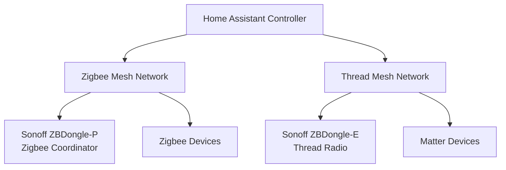
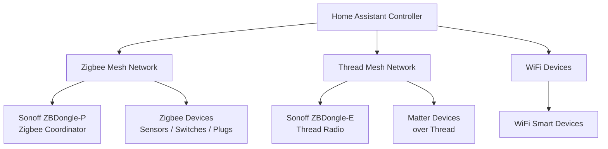
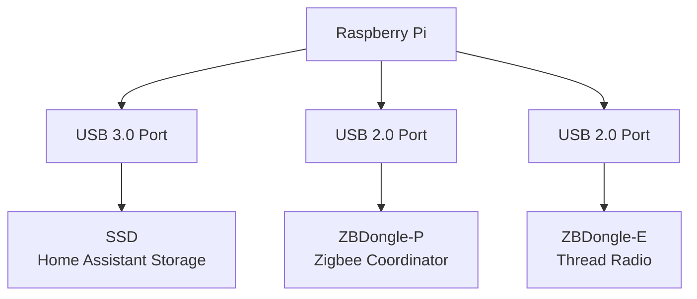
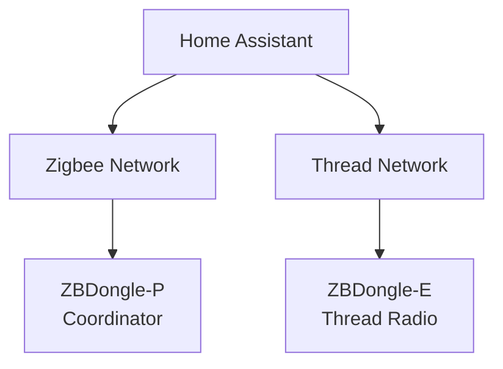

# Home Assistant Thread Setup Guide
Guide for setting up **Matter over Thread in Home Assistant** using a **Sonoff ZBDongle-E Thread radio** and **OpenThread Border Router**, alongside a **Zigbee network using the ZBDongle-P**.

Using the **Sonoff ZBDongle-E** as a dedicated **Thread radio** in Home Assistant with **OpenThread RCP and Matter**.

⭐ If this guide helped you, please consider **starring this repository**.

---

## Quick Navigation

- [Smart Home Protocol Stack](#smart-home-protocol-stack)
- [Hardware Used](#hardware-used)
- [Recommended USB Layout](#recommended-usb-layout)
- [Flashing the ZBDongle-E](#step-2--flash-thread-firmware)
- [OpenThread Border Router Setup](#step-3--install-openthread-border-router)
- [Thread Integration](#step-5--verify-thread-integration)
- [Matter Integration](#step-6--install-matter)
---

# Home Assistant Thread Setup Guide
## Using the Sonoff ZBDongle-E as a Thread Radio (OpenThread RCP + Matter)

This guide explains how to convert a **Sonoff ZBDongle-E (Lite MG21)** into a dedicated **Thread radio** for Home Assistant using **OpenThread RCP firmware**.

The setup enables a reliable **Matter over Thread network** while running a separate **Zigbee network** using a dedicated Zigbee coordinator.

Hardware used in this guide:

• **Sonoff ZBDongle-E (Thread radio)**  
• **Sonoff ZBDongle-P (Zigbee coordinator)**  
• **Raspberry Pi 4 running Home Assistant OS**
---
## Architecture Overview

# Smart Home Protocol Stack

Modern Home Assistant installations often support multiple smart home protocols simultaneously.

The architecture below shows how **Zigbee, Thread, Matter, and Wi-Fi devices connect through Home Assistant**.

---

## How These Technologies Work Together

**Zigbee**

A low-power 2.4GHz mesh network used by many smart home sensors and switches.  
Requires a **Zigbee coordinator**, such as the **ZBDongle-P**.

**Thread**

A modern IPv6-based mesh network used by many **Matter devices**.  
Requires a **Thread radio** and **OpenThread Border Router**.

**Matter**

A smart home interoperability standard that allows devices from different manufacturers to work together.

Matter devices may communicate over:

• Thread  
• WiFi  
• Ethernet

**WiFi Devices**

Many smart home devices connect directly to the network using WiFi and integrate directly with Home Assistant.

---

## Why This Architecture Works Well

Using **dedicated radios for Zigbee and Thread** provides:

• better stability  
• better wireless performance  
• easier troubleshooting  
• future-proof smart home infrastructure

Home Assistant then acts as the **central controller** for all devices.
---

# Table of Contents

1. Hardware Used  
2. Recommended USB Layout  
3. Flashing the ZBDongle-E with Thread Firmware  
4. Installing OpenThread Border Router  
5. Configuring the Thread Radio  
6. Verifying the Thread Network  
7. Installing Matter  
8. Zigbee and Thread Mesh Networks  
9. Final Architecture  

---

# Hardware Used

## Thread Radio

**SONOFF ZBDongle-E (Lite MG21)**

If you need to purchase one, you can use my affiliate link:

https://amzn.to/46KR1eh

Note: The link above is an affiliate link. If you purchase through it, it may provide a small commission at no additional cost to you which helps the channel grow.

---

## Zigbee Coordinator

For Zigbee devices I recommend using the **Sonoff Zigbee 3.0 USB Dongle Plus (ZBDongle-P)**.

SONOFF Universal Zigbee 3.0 USB Dongle Plus Gateway with Antenna for Home Assistant, IoBroker and Zigbee2MQTT:

https://amzn.to/47tOtS2

Using **separate radios for Zigbee and Thread** provides much better reliability than running both protocols on the same device.

---

# Storage Recommendation (Important)

If you are running Home Assistant on a Raspberry Pi, it is **strongly recommended** to use an SSD.

Recommended minimum:

256GB SSD

The SSD should be connected to a **USB 3.0 port** to maximise performance.

---

# Recommended USB Layout

When using multiple USB devices, it is best to separate **storage devices from radio devices**.

This reduces potential **2.4 GHz interference** and improves the reliability of both Zigbee and Thread networks.

## Recommended Layout

## Why This Matters

• USB 3 ports can introduce **electromagnetic interference in the 2.4 GHz spectrum**  
• Both **Zigbee and Thread operate on 2.4 GHz**  
• Placing radios on **USB 2 ports reduces interference and improves stability**

## Best Practice

Use **short USB extension cables** for radio dongles so they are not directly attached to the Raspberry Pi.

Benefits:

• Reduces RF interference  
• Improves wireless signal strength  
• Avoids USB electrical noise near the radios

For SSD enclosures connected to USB 3 ports, ensure cables are **USB 3.0 certified** to avoid performance or I/O errors. 

---

# Use USB Extension Cables

Radio dongles should not be plugged directly into the Raspberry Pi.

Use **short USB extension cables** to move the radio away from the board.

Benefits:

• Reduces RF interference  
• Improves signal strength  
• Prevents USB noise  

Ensure cables are good quality.

For SSD enclosures using a USB 3 port, ensure cables are **USB 3.0 certified** to avoid I/O errors or performance issues.

---

# Step 1 — Create a Home Assistant Backup

Before flashing the dongle, create a **full Home Assistant backup**.

This is particularly important if the **ZBDongle-E was previously used as a Zigbee coordinator**.

Home Assistant → Settings → System → Backups

---

# Step 2 — Flash Thread Firmware

The ZBDongle-E must be flashed with **OpenThread RCP firmware**.

Important:

Connect the dongle to a **separate computer** for flashing, not the Raspberry Pi running Home Assistant.

When selecting firmware, ensure the description contains **Thread / OpenThread / RCP**.

Example firmware description may include:

OpenThread RCP firmware  
Thread radio firmware  

---

## Windows Driver Note

Sometimes Windows may not automatically detect the dongle correctly.

If the device does not appear:

• Install the Silicon Labs USB driver  
• Reconnect the device  
• Try another USB port  

Updating drivers may not immediately show the device in Device Manager until the dongle is reinserted.

---

# Step 3 — Install OpenThread Border Router

In Home Assistant:

Settings → Add-ons → Add-on Store

Install:

**OpenThread Border Router**

After installation, configure the device path to the **ZBDongle-E serial device**.

---

# Step 4 — Configure the Thread Radio

Select the device corresponding to the **ZBDongle-E USB device**.

Example:

/dev/serial/by-id/usb-SONOFF_SONOFF_Dongle_Lite_MG21

Typical configuration:

Baudrate: **460800**

Save configuration and start the add-on.

---

# OpenThread Border Router Configuration

After installing the OpenThread Border Router add-on, configure it to use the ZBDongle-E device.

---

# Step 5 — Verify Thread Integration

Once the OTBR add-on starts successfully:

Settings → Devices & Services → Thread

You should see your Thread network with a **Border Router**.

## Thread Integration

---

# Step 6 — Install Matter

Next install the **Matter integration**.

Settings → Devices & Services → Add Integration → Matter

Matter allows devices to communicate using:

• Thread  
• WiFi  
• Ethernet  

---

# Zigbee and Thread Mesh Networks

Both Zigbee and Thread operate as **mesh networks**.

This means devices can relay messages through other devices.

---

## Zigbee Mesh

Zigbee networks extend when **mains-powered devices** act as routers.

Examples:

• smart plugs  
• smart switches  
• wired modules  
• some smart bulbs  

Battery devices such as sensors are **end devices** and do not extend the mesh.

---

## Thread Mesh

Thread also uses a mesh architecture.

Powered Thread devices automatically become **Thread routers**, extending the network.

Battery devices act as **sleepy end devices** and connect through nearby routers.

---

## Example Architecture

The recommended setup uses **separate radios for Zigbee and Thread** to maximise reliability and avoid protocol conflicts.

# Final Result

Your Home Assistant installation now supports:

• Zigbee devices  
• Thread devices  
• Matter devices  
• WiFi devices  

all managed through a single platform.

This architecture provides a **reliable and scalable smart home setup**.

---

⭐ If this guide helped you, please consider **starring the repository**.
